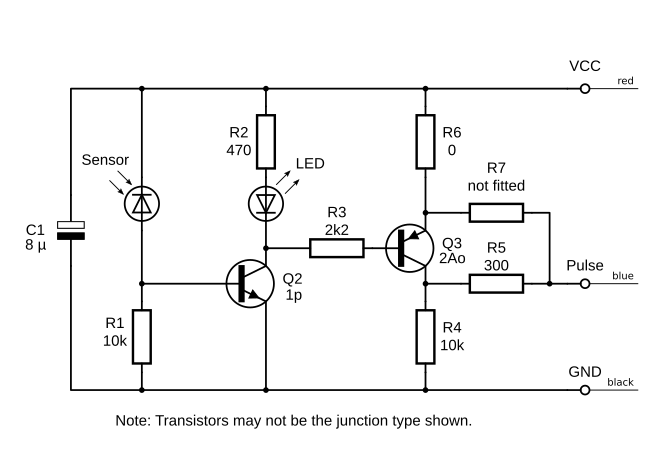

# optical-pulse-sensor

Hardware resources for the [optical pulse sensor](https://shop.openenergymonitor.com/optical-utility-meter-led-pulse-sensor/).

Thanks to [@warrenashcroft](https://community.openenergymonitor.org/u/warrenashcroft) for reverse engineering the OPS, see [forum thread](https://community.openenergymonitor.org/t/pulse-counting-sensor-unstable-over-1-5m-rj45-extension).

